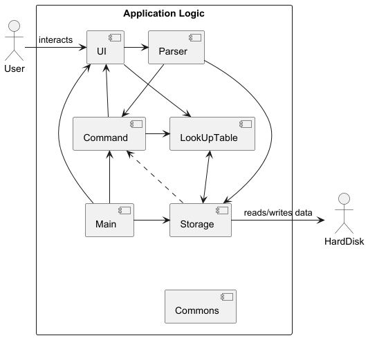
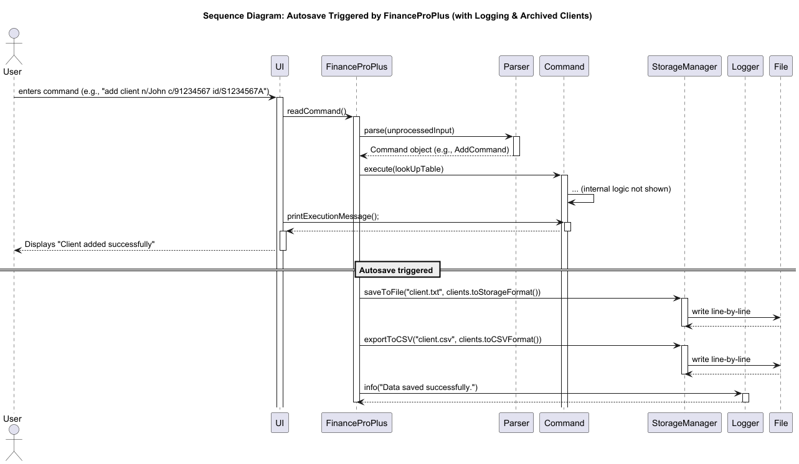
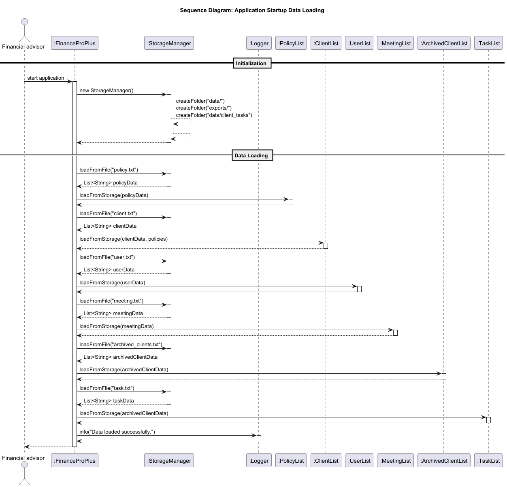
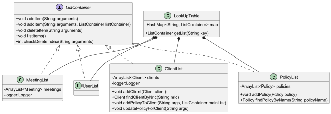
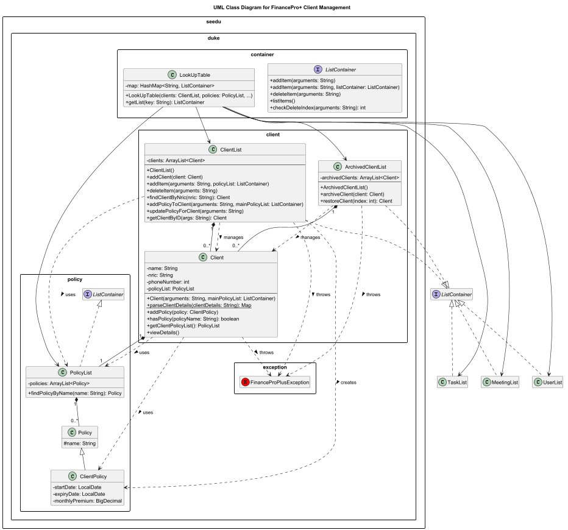
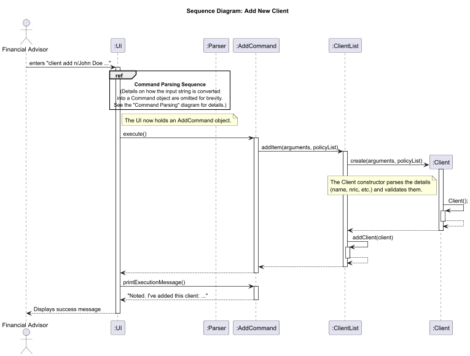
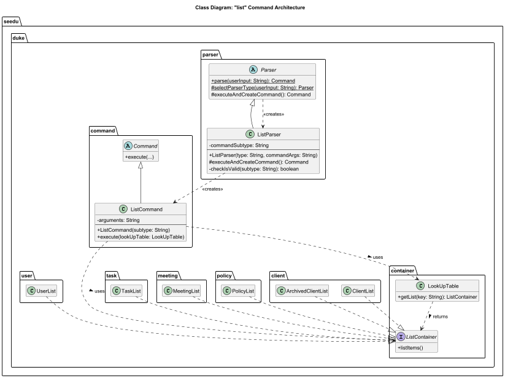
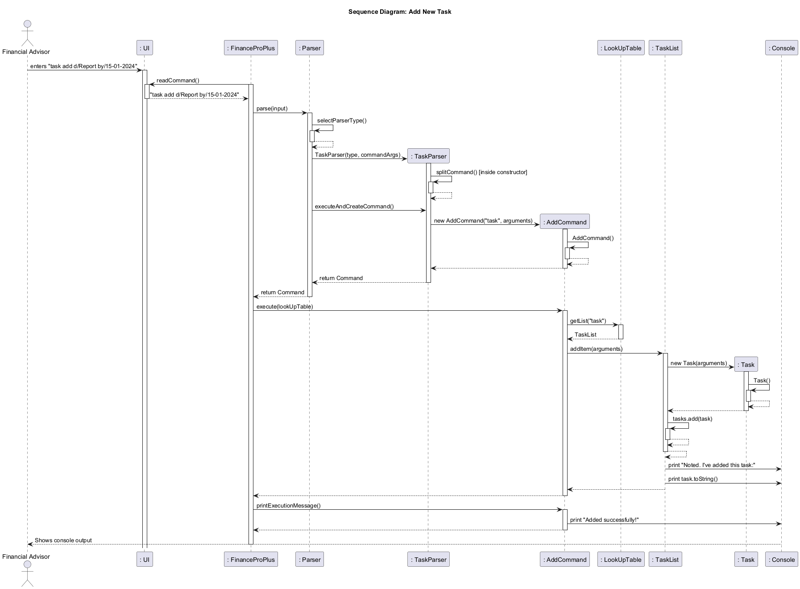
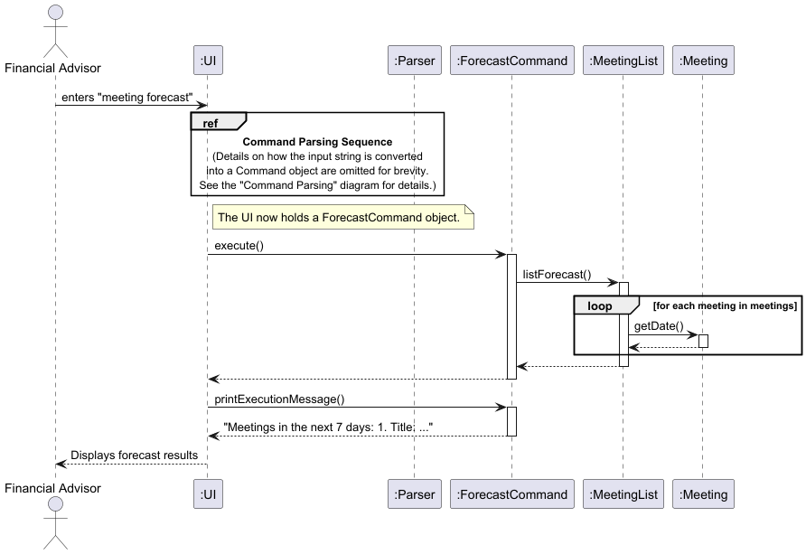

# Developer Guide

## Acknowledgements
This was heavily inspired by the AB3 reference DG found [here](https://github.com/se-edu/addressbook-level3/blob/master/docs/DeveloperGuide.md)

{list here sources of all reused/adapted ideas, code, documentation, and third-party libraries -- include links to the original source as well}

## Design & implementation
### Architecture

Here is a quick Overview of Main Components and how they interact with each other:

#### Main Components of the architecture
`Main` is in charge of the app launch and shut down. 
* At app launch, it initializes all other components.
* At shutdown, it shuts down the other components and invoked the java garbage collector where necessary

The App is consisted of the following four components:
* UI: The UI of the app
* Storage: Holds the Data of the App in Memory
* Parser: Finds the appropriate command and returns it to UI
* Commons: Consists of various classes that interact with other components
* LookUpTable: Consists a Look Up Table of various lists that store data
* Command: The command executer

### Storage Component

The **StorageManager** class is responsible for all file operations in the application, including reading, writing, and exporting data.  
It ensures that user data, client data, archived clients, tasks, policies, and meeting records are automatically persisted to disk after every command execution  minimizing data loss risks even during unexpected shutdowns.

#### Design Overview
The `FinanceProPlus` class manages the autosave feature through its `saveAllData()` method, which is triggered after each executed command.  
This guarantees that all updates made during runtime  including new tasks, meetings, or clients — are immediately written to disk without requiring explicit user action to save.

Each dataset (User, Client, ArchivedClient, Policy, Meeting, and Task) is stored in both:
- **Text format** (`.txt`) – for reliable internal persistence and reloading.
- **CSV format** (`.csv`) – for user-friendly export and analysis.

All saved data resides within two primary directories:
- `data/` — used for internal save and load operations.
- `exports/` — used for external CSV exports (e.g., viewing in Excel).

#### Key Data Files
| Data Type | Text File | CSV File |
|------------|------------|----------|
| User | `user.txt` | `user.csv` |
| Client | `client.txt` | `client.csv` |
| Archived Clients | `archived_clients.txt` | `archived_clients.csv` |
| Policy | `policy.txt` | `policy.csv` |
| Meeting | `meeting.txt` | `meeting.csv` |
| Task | `task.txt` | `task.csv` |
#### Workflow Description (Autosave)
1. After the user enters a command, `Parser.parse()` creates a `Command` object.
2. The command executes and updates the respective data list(s).
3. `FinanceProPlus` automatically invokes `saveAllData()`.
4. Each list’s data is written to `.txt` and `.csv` files via `StorageManager`.
5. The `StorageManager` logs a success message (`logger.info("Data saved successfully.")`).

Errors during saving are logged internally and not printed to the user — keeping the UI clean but traceable through logs.

#### Rationale for Design
- **Autosave per command** guarantees maximum reliability — no manual save needed.
- **Centralized save logic** inside `FinanceProPlus` keeps design modular and testable.
- **Logging instead of printing** ensures users aren’t spammed with system messages.

---

### Storage Initialization on Startup

When the program launches, previously saved data is automatically loaded into memory.  
This allows users to seamlessly continue from where they left off without manually restoring files.

#### Design Overview
On startup, the `FinanceProPlus` constructor initializes the `StorageManager` and sequentially loads data from disk into each component:
- **PolicyList**
- **ClientList**
- **UserList**
- **MeetingList**
- **ArchivedClientList**
- **TaskList**

If any file is missing or unreadable, the app logs the issue but continues loading other data, ensuring robust operation even with partial data.

#### Workflow Description (Startup Loading)
1. `FinanceProPlus` is instantiated.
2. `StorageManager` is initialized, creating necessary folders.
3. The following load sequence occurs:
    - `policies.loadFromStorage(storage.loadFromFile("policy.txt"));`
    - `clients.loadFromStorage(storage.loadFromFile("client.txt"), policies);`
    - `user.loadFromStorage(storage.loadFromFile("user.txt"));`
    - `meetings.loadFromStorage(storage.loadFromFile("meeting.txt"));`
    - `archivedClients.loadFromStorage(storage.loadFromFile("archived_clients.txt"));`
    - `tasks.loadFromStorage(storage.loadFromFile("task.txt"));`
4. Each list reconstructs its objects from text lines.
5. `Logger.info("Data loaded successfully.")` confirms successful initialization.

If no files exist (first launch), blank lists are created and files will be generated automatically upon the first autosave.

#### Rationale for Design
- Guarantees users always resume with consistent data.
- Prevents startup failure even if a single data file is missing.
- Keeps all load logic centralized within `FinanceProPlus` for easier debugging and maintenance.

---

### LookUpTable Component

API: [LookUpTable](./seedu/duke/container/LookUpTable.java)

The components`[meeting, client, policy, user]` is built around the ListContainer interface, which provides a powerful abstraction for any class that manages a collection of items. This design promotes polymorphism and loose coupling, allowing different parts of the application to interact with various lists (clients, policies, etc.) in a standardized way.
ListContainer Interface: Defines the essential methods that any list-like data structure in the application must implement:
* `addItem(...)`: To add a new item.
* `deleteItem(...)`: To remove an item.
* `listItems()`: To display all items.
* `checkDeleteIndex(...)`: To validate an index for deletion.

In the LookUptable Component,
* It stores the various lists(ClientList,PolicyList,MeetingList,UserList) that implements the ListContainer Interface.
* Once instantiated, the constructor creates the list objects and stores it as a Hashmap with the appropriate key-value pairs
* The LookUpTable is composed of the lists. If deleted, the list objects will be destroyed

### Client Features
To begin, here is a high level Class Diagram of Clients and its interaction with other classes:

The Client Management component is the core of handling customer data within the application. It is responsible for creating, storing, retrieving, updating, and archiving client profiles. The design separates active clients from archived clients and uses a common interface (ListContainer) to ensure consistent handling of data collections throughout the application.

The primary classes in this component are:
* Client: The data model representing an individual client.
* ClientList: The manager for all active clients.
* ArchivedClientList: A specialized manager for inactive/archived clients.
* ListContainer: An interface defining a standard contract for list operations.
#### 1. Client Class Breakdown
   **Responsibility:** Acts as the data model for a single client. It encapsulates all information related to a client, including their personal details and associated insurance policies.
   
**Key Attributes:** 
   * `name, nric, phoneNumber`: Basic personal information.
   * `policyList`: A PolicyList object that holds all policies associated with this specific client. This is a composition relationship—a Client has a PolicyList.
   * `Key Behaviors`:
     - The constructor `Client(String arguments, ...) ` is responsible for parsing a formatted string to populate the client's details.
     - `addPolicy()` allows adding a new ClientPolicy to its internal policyList.
     - `toStorageString()` and `toCSVRow()` provide standardized ways to serialize client data for file storage and export.
#### 2. ClientList Class Breakdown
   **Responsibility**: Manages the collection of all active clients. It serves as the primary entry point for all operations on active clients, such as adding, searching, and updating them.

   **Relationship**: Implements the ListContainer interface.

   **Key Attributes**:
   `clients`: An ArrayList<Client> to store the active client objects.
   
**Key Behaviors**:

   * `addItem(arguments, policyList)`: Parses user input, validates that the client doesn't already exist (by NRIC), and creates and adds a new Client object.
   * `deleteItem(arguments)`: Removes a client from the active list based on their index. This client would typically be moved to the ArchivedClientList by a higher-level command handler.
   * `findClientByNric(nric)`: A crucial lookup method to retrieve a specific client.
   * `addPolicyToClient(...)` & `updatePolicyForClient(...)`: Contains the business logic to modify a client's policy details. It first finds the client and then delegates the policy update to the Client and ClientPolicy objects.
#### 3. Archived ClientList Class Breakdown
**Responsibility**: Manages clients who are no longer active. It provides a limited, more secure set of interactions compared to ClientList.
   **Relationship**: Implements the ListContainer interface.
   **Key Behaviors**:
   * **Distinct Operations**: Its main public methods are archiveClient(Client) and restoreClient(index).
   * **Restricted Operations**: To prevent accidental modification, standard ListContainer methods like addItem() and deleteItem() are overridden to throw a FinanceProPlusException. This is an important design choice, enforcing the rule that clients can only enter this list via archiving and leave via restoring.
   * **Responsibility**: Acts as a centralized registry or service locator for all major ListContainer instances in the application (clients, policies, meetings, etc.).
   * **Relationship**: It holds a HashMap mapping string keys (e.g., "client", "policy") to their corresponding ListContainer objects. 
   * **Usage**: Instead of passing multiple list objects through many method calls, a command can simply request the required list from the LookUpTable using a key (e.g., lookupTable.getList("client")).
### 4. Key Interactions and Data Flow
   **Client Creation**: A command parses user input and calls ClientList.addItem(). ClientList creates a new Client instance, which in turn parses the detailed arguments. The main PolicyList is passed during creation for validation purposes.
   
**Archiving a Client**: A client object is removed from the ClientList and passed to the ArchivedClientList.archiveClient() method.
   
**Adding a Policy**: A command calls ClientList.addPolicyToClient(). ClientList finds the client by NRIC, validates the new policy against the main PolicyList, creates a ClientPolicy instance, and then calls the client.addPolicy() method to add it to the client's internal list.
### 5. Error Handling
   **FinanceProPlusException**: This custom exception is used consistently across all classes to signal errors related to business logic (e.g., duplicate client, invalid index) or data validation (e.g., malformed input, missing fields). This standardizes error handling throughout the component.

### 6.Example of Adding a Client
When a command with the prefix "client" is invoked by the user, here is a sequence diagram depicting the overall flow of the program.

To explain  an example of the command. The user(Financial Advisor), first issues a command, this command is passed into the UI. Class, the UI calls the parse command to pass the data into an instantiated parser for processing.

In the parser, it then further breaks it down into respective child classes, in this case, it is the ClientParser Child class. This class splits the processed string into further substrings and then calls the constructor for AddCommand. AddCommand calls itself to instantiate some methods
and hands back the control signal to Client Parser. ClientParser hands back signal to Parser and Parser hands back signal to UI. UI then calls the execute method from Add Command. Add Command calls Client List to addItem.

In the Additem function it creates a new Client Object. In the Client Object Constructor it does the verification and instantiates the attributes. The client object then returns the control signal back to ClientList.
ClientList then does a callback method AddClient to add the client into the clientlist object  and then the additem callback is finished.

ClientList then hands back control to Add Command and Add Command adds gives back the control to UI.
UI then calls the method printExecutionMessage() to AddCommand and AddCommand returns control back to UI with data. UI then displays the success message to the user.
### List Feature, Design and Implementation
The list command is designed based on key software engineering principle, Polymorphism. This architecture ensures that the command is both robust and easily extensible.

1. **Parser**
   * **Role**: The entry point for command parsing
   * **Responsibility**: It determines the general command type from user input (e.g., "list", "client", "add") and delegates the detailed parsing to a specialized parser subclass.
2. **ListParser** 
    * **Role**: The specialized parser for the list command.
   * **Responsibility**: It is responsible for validating the arguments of the list command (e.g., ensuring list client is valid but list product is not). Its primary goal is to instantiate a correctly configured ListCommand object.
3. **Command**
    * **Role**: The base class for all executable commands.
   * **Responsibility**: Defines a common execute() method, ensuring that the main application loop can execute any command object polymorphically without needing to know its specific type.

4. **ListCommand**
* **Role**: The object that encapsulates all information needed to execute a list request.
* **Responsibility**: When its execute() method is called, it uses its stored argument (e.g., "client") to retrieve the appropriate data container from the LookUpTable and then calls the listItems() method on that container. It is completely decoupled from the specific type of list it is operating on.

5. **ListContainer**
* **Role**: A contract for all data-holding classes.
* **Responsibility**: It standardizes the API for interacting with collections of data. Any class that implements
ListContainer (like ClientList, PolicyList, etc.) guarantees it will have a listItems() method, which is crucial for the ListCommand to function.

6. **LookUpTable**
* **Role**: A centralized registry for all ListContainer instances.
* **Responsibility**: It provides a single point of access for commands to retrieve the data containers they need to operate on, decoupling the command from the storage details of the lists.
ClientList then does a callback method AddClient to add the client into the clientlist object  and then the additem callback is finished. ClientList then hands back control to Add Command and Add Command adds gives back the control to UI.
UI then calls the method printExecutionMessage() to AddCommand and AddCommand returns control back to UI with data. UI then displays the success message to the user.

### Task Management Feature

The Task Management feature allows financial advisors to create and manage standalone tasks with due dates. This feature enables users to track action items, deadlines, and follow-ups independently of clients or policies, providing a comprehensive task management system within FinanceProPlus.

#### Implementation

The task management feature is implemented through several key components that work together to parse user input, validate task details, and persist task data. The implementation follows the existing architecture pattern established for other entities (clients, policies, meetings) in the system.

##### Architecture-Level Design

At the architecture level, the task feature integrates seamlessly with the existing components:

1. UI Component: Receives the user's task command (e.g., task add d/Report by/15-01-2024)
2. Parser Component: Routes the command to TaskParser, which interprets the command subtype and extracts arguments
3. Command Component: Creates and executes an AddCommand with the task subtype
4. LookUpTable Component: Retrieves the appropriate TaskList to handle the operation
5. Model Component: Task objects encapsulate task data including description and due date

##### Task Creation Process

When a user creates a new task, the following sequence of operations occurs:

### Meeting Features
When the command "meeting forecast" is invoked by a user, here is a sequence diagram depicting the overall flow of the program.

When the user issues the command "meeting forecast" the command is first passed through the UI class. The UI then calls for the Parser which determines the command type as "meeting" and creates a new MeetingParser instance with the command arguments.
The MeetingParser processes the command by calling executeAndCreateCommand() method which identifies this as a forecast operation and instantiates a new ForecastCommand object. Control is returned to the UI, which then calls execute() on the ForecastCommand.
The ForecastCommand invokes listForecast() on the MeetingList to retrieve the upcoming meetings. The MeetingList iterates through all the stored meetings, and calls getDate() on each Meeting object to verify if it falls within the next 7 days from the current date.
The MeetingList then returns all valid results to the ForecastCommand which formats the output and returns it to the UI. The UI finally displays the forecast results to the user, showing all meetings scheduled for the upcoming week.

## Product scope
### Target user profile

{Describe the target user profile}

### Value proposition

{Describe the value proposition: what problem does it solve?}

## User Stories

|Version| As a ... | I want to ... | So that I can ...|
|--------|----------|---------------|------------------|
|v1.0|new user|see usage instructions|refer to them when I forget how to use the application|
|v2.0|user|find a to-do item by name|locate a to-do without having to go through the entire list|

## Non-Functional Requirements

{Give non-functional requirements}

## Glossary

* *glossary item* - Definition

## Instructions for manual testing

{Give instructions on how to do a manual product testing e.g., how to load sample data to be used for testing}
