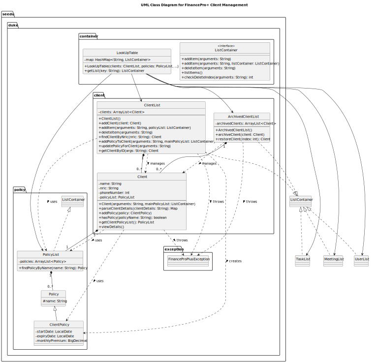

# Developer Guide
*   [Acknowledgements](#acknowledgements)
*   [Design & implementation](#design--implementation)
    *   [Architecture](#architecture)
    *   [Storage Component](#storage-component)
    *   [Storage Initialization on Startup](#storage-initialization-on-startup)
    *   [LookUpTable Component](#lookuptable-component)
    *   [Client Features](#client-features)
    *   [Command Execution Flow: A Detailed Walkthrough](#command-execution-flow-a-detailed-walkthrough)
    *   [List Feature, Design and Implementation](#list-feature-design-and-implementation)
    *   [Task Management Feature](#task-management-feature)
    *   [Meeting Features](#meeting-features)
*   [Product scope](#product-scope)
    *   [Target user profile](#target-user-profile)
    *   [Value proposition](#value-proposition)
*   [User Stories](#user-stories)
*   [Non-Functional Requirements](#non-functional-requirements)
*   [Glossary](#glossary)
*   [Instructions for manual testing](#instructions-for-manual-testing)

## Acknowledgements
This was heavily inspired by the AB3 reference DG found [here](https://github.com/se-edu/addressbook-level3/blob/master/docs/DeveloperGuide.md)

## Design & implementation
### Architecture


Here is a quick Overview of Main Components and how they interact with each other:

#### Main Components of the architecture
`Main` is in charge of the app launch and shut down. 
* At app launch, it initializes all other components.
* At shutdown, it shuts down the other components and invoked the java garbage collector where necessary

The App is consisted of the following four components:
* UI: The UI of the app
* Storage: Holds the Data of the App in Memory
* Parser: Finds the appropriate command and returns it to UI
* Commons: Consists of various classes that interact with other components
* LookUpTable: Consists a Look Up Table of various lists that store data
* Command: The command executer

### Storage Component

The **StorageManager** class is responsible for all file operations in the application, including reading and writing data to disk.  
It ensures that user data, client data, archived clients, per-client to-dos, policies, and meeting records are automatically persisted to disk after every command execution — minimizing data loss risks even during unexpected shutdowns.


#### Design Overview
The `FinanceProPlus` class manages the autosave feature through its `saveAllData()` method, which is triggered after each executed command.  
This guarantees that all updates made during runtime — including new clients, tasks, meetings, or policies — are immediately written to disk without requiring explicit user action to save.

Each dataset (User, Client, ArchivedClient, Policy, Meeting, and ClientTasks) is stored in **text format (`.txt`)** for reliable internal persistence and reloading.

All saved data resides within a single primary directory:
- `data/` — used for internal save and load operations.

#### Key Data Files


| Data Type        | Storage Location               | Example Path                      |
| :--------------- | :----------------------------- | :-------------------------------- |
| User             | `data/user.txt`                | `data/user.txt`                   |
| Client           | `data/client.txt`              | `data/client.txt`                 |
| Archived Clients | `data/archived_clients.txt`    | `data/archived_clients.txt`       |
| Policy           | `data/policy.txt`              | `data/policy.txt`                 |
| Meeting          | `data/meeting.txt`             | `data/meeting.txt`                |
| Client Todos     | `data/client_tasks/<NRIC>.txt` | `data/client_tasks/S1234567A.txt` |
| Task             | `task.txt`                     | `task.csv`                        |


#### Client Task Storage Design (`client_tasks/` Folder)
Each client’s personal to-do list is saved in a separate text file named after their NRIC, located inside the `client_tasks/` subfolder.  
This design ensures isolation between clients and simplifies debugging, updating, and file management.

#### Workflow Description (Autosave)
1. After the user enters a command, `Parser.parse()` creates a `Command` object.
2. The command executes and updates the respective data list(s).
3. `FinanceProPlus` automatically invokes `saveAllData()`.
4. Each list’s data is written to `.txt` and `.csv` files via `StorageManager`.
5. The `StorageManager` logs a success message (`logger.info("Data saved successfully.")`).

Errors during saving are logged internally and not printed to the user keeping the UI clean but traceable through logs.

#### Rationale for Design
- **Autosave per command** guarantees maximum reliability, no manual save needed.
- **Centralized save logic** inside `FinanceProPlus` keeps design modular and testable.
- **Logging instead of printing** ensures users aren’t spammed with system messages.

---

### Storage Initialization on Startup

When the program launches, previously saved data is automatically loaded into memory.  
This allows users to seamlessly continue from where they left off without manually restoring files.


#### Design Overview
On startup, the `FinanceProPlus` constructor initializes the `StorageManager` and sequentially loads data from disk into each component:
- **PolicyList**
- **ClientList**
- **UserList**
- **MeetingList**
- **ArchivedClientList**
- **TaskList**
- **Per-Client TaskLists** (located under `data/client_tasks/`)

If any file is missing or unreadable, the app logs the issue but continues loading other data, ensuring robust operation even with partial data.

#### Workflow Description (Startup Loading)
1. `FinanceProPlus` is instantiated.
2. `StorageManager` is initialized, creating necessary folders.
3. The following load sequence occurs:
    - `policies.loadFromStorage(storage.loadFromFile("policy.txt"));`
    - `clients.loadFromStorage(storage.loadFromFile("client.txt"), policies);`
    - `user.loadFromStorage(storage.loadFromFile("user.txt"));`
    - `meetings.loadFromStorage(storage.loadFromFile("meeting.txt"));`
    - `archivedClients.loadFromStorage(storage.loadFromFile("archived_clients.txt"));`
    - `tasks.loadFromStorage(storage.loadFromFile("task.txt"));`
    - iterates through each client and updates their personal todolist.
4. Each list reconstructs its objects from text lines.
5. `Logger.info("Data loaded successfully.")` confirms successful initialization.

If no files exist (first launch), blank lists are created and files will be generated automatically upon the first autosave.

#### Rationale for Design
- Guarantees users always resume with consistent data.
- Allow for transfer of data from different devices.

---

### LookUpTable Component

API: [LookUpTable](../src/main/java/seedu/duke/container/LookUpTable.java)


The components`[meeting, client, policy, user]` is built around the ListContainer interface, which provides a powerful abstraction for any class that manages a collection of items. This design promotes polymorphism and loose coupling, allowing different parts of the application to interact with various lists (clients, policies, etc.) in a standardized way.
ListContainer Interface: Defines the essential methods that any list-like data structure in the application must implement:
* `addItem(...)`: To add a new item.
* `deleteItem(...)`: To remove an item.
* `listItems()`: To display all items.
* `checkDeleteIndex(...)`: To validate an index for deletion.

In the LookUptable Component,
* It stores the various lists(ClientList,PolicyList,MeetingList,UserList) that implements the ListContainer Interface.
* Once instantiated, the constructor creates the list objects and stores it as a Hashmap with the appropriate key-value pairs
* The LookUpTable is composed of the lists. If deleted, the list objects will be destroyed


### Client Features
To begin, here is a high level Class Diagram of Clients and its interaction with other classes:



The Client Management component is the core of handling customer data within the application. It is responsible for creating, storing, retrieving, updating, and archiving client profiles. The design separates active clients from archived clients and uses a common interface (ListContainer) to ensure consistent handling of data collections throughout the application.

The primary classes in this component are:
* Client: The data model representing an individual client.
* ClientList: The manager for all active clients.
* ArchivedClientList: A specialized manager for inactive/archived clients.
* ListContainer: An interface defining a standard contract for list operations.
#### 1. Client Class Breakdown
   **Responsibility:** Acts as the data model for a single client. It encapsulates all information related to a client, including their personal details and associated insurance policies.
   
**Key Attributes:** 
   * `name, nric, phoneNumber`: Basic personal information.
   * `policyList`: A PolicyList object that holds all policies associated with this specific client. This is a composition relationship—a Client has a PolicyList.
   * `Key Behaviors`:
     - The constructor `Client(String arguments, ...) ` is responsible for parsing a formatted string to populate the client's details.
     - `addPolicy()` allows adding a new ClientPolicy to its internal policyList.
     - `toStorageString()` and `toCSVRow()` provide standardized ways to serialize client data for file storage and export.
#### 2. ClientList Class Breakdown
   **Responsibility**: Manages the collection of all active clients. It serves as the primary entry point for all operations on active clients, such as adding, searching, and updating them.

   **Relationship**: Implements the ListContainer interface.

   **Key Attributes**:
   `clients`: An ArrayList<Client> to store the active client objects.
   
**Key Behaviors**:

   * `addItem(arguments, policyList)`: Parses user input, validates that the client doesn't already exist (by NRIC), and creates and adds a new Client object.
   * `deleteItem(arguments)`: Removes a client from the active list based on their index. This client would typically be moved to the ArchivedClientList by a higher-level command handler.
   * `findClientByNric(nric)`: A crucial lookup method to retrieve a specific client.
   * `addPolicyToClient(...)` & `updatePolicyForClient(...)`: Contains the business logic to modify a client's policy details. It first finds the client and then delegates the policy update to the Client and ClientPolicy objects.
#### 3. Archived ClientList Class Breakdown
**Responsibility**: Manages clients who are no longer active. It provides a limited, more secure set of interactions compared to ClientList.
   **Relationship**: Implements the ListContainer interface.
   **Key Behaviors**:
   * **Distinct Operations**: Its main public methods are archiveClient(Client) and restoreClient(index).
   * **Restricted Operations**: To prevent accidental modification, standard ListContainer methods like addItem() and deleteItem() are overridden to throw a FinanceProPlusException. This is an important design choice, enforcing the rule that clients can only enter this list via archiving and leave via restoring.
   * **Responsibility**: Acts as a centralized registry or service locator for all major ListContainer instances in the application (clients, policies, meetings, etc.).
   * **Relationship**: It holds a HashMap mapping string keys (e.g., "client", "policy") to their corresponding ListContainer objects. 
   * **Usage**: Instead of passing multiple list objects through many method calls, a command can simply request the required list from the LookUpTable using a key (e.g., lookupTable.getList("client")).
### 4. Key Interactions and Data Flow
   **Client Creation**: A command parses user input and calls ClientList.addItem(). ClientList creates a new Client instance, which in turn parses the detailed arguments. The main PolicyList is passed during creation for validation purposes.
   
**Archiving a Client**: A client object is removed from the ClientList and passed to the ArchivedClientList.archiveClient() method.
   
**Adding a Policy**: A command calls ClientList.addPolicyToClient(). ClientList finds the client by NRIC, validates the new policy against the main PolicyList, creates a ClientPolicy instance, and then calls the client.addPolicy() method to add it to the client's internal list.
### 5. Error Handling
   **FinanceProPlusException**: This custom exception is used consistently across all classes to signal errors related to business logic (e.g., duplicate client, invalid index) or data validation (e.g., malformed input, missing fields). This standardizes error handling throughout the component.

### 6.Example of Adding a Client
When a command with the prefix "client" is invoked by the user, here is a sequence diagram depicting the overall flow of the program.


### Command Execution Flow: A Detailed Walkthrough

The application's command processing pipeline is designed around the **Command Design Pattern**. This decouples the invoker of a command (the `Ui`) from the object that knows how to perform the action (the concrete `Command` object).

Here is a step-by-step breakdown of the execution flow for a typical command, such as `client add n/Zendne ...`.


#### Phase 1: Parsing and Command Instantiation

This phase is responsible for converting the user's raw input string into an executable `Command` object.

1.  **Input Capture:** The `Ui` component captures the raw command string from the user.

2.  **Initial Parsing:** The main application loop invokes the static `Parser.parse(string)` method. This top-level parser acts as a **Factory**. It inspects the first word of the command (e.g., `"client"`) to determine which specialized parser to use.

3.  **Delegation to Sub-Parser:** The `Parser` factory instantiates a specific subclass, in this case, `new ClientParser(...)`, and passes the remaining arguments to it.

4.  **Command Creation:** The `ClientParser` identifies the command's subtype (e.g., `"add"`) and its arguments. It then instantiates the corresponding concrete command object:
    ```
    new AddCommand("client", "n/Zendne ...");
    ```

5.  **Return to Caller:** This newly created `AddCommand` object is returned all the way up the call stack to the main application loop in `FinanceProPlus`. At this point, the application holds an executable object but has not yet performed any action.


#### Phase 2: Execution and Business Logic

This phase is where the `Command` object performs its designated action by interacting with the data models.

1.  **Invocation:** The main loop calls the `execute(lookUpTable)` method on the `AddCommand` object.

2.  **Dependency Retrieval:** The `AddCommand` uses the `lookUpTable` (a form of dependency injection) to get a reference to the `ClientList` instance, which is the model responsible for managing client data.

3.  **Delegation to Model:** The command's responsibility is orchestration, not business logic. It delegates the core work by calling `clientList.addItem(arguments, mainPolicyList)`.

4.  **Business Logic & Validation:** Inside `ClientList.addItem()`, critical business logic is executed:
    *   It first validates the request (e.g., checks if a client with the same NRIC already exists).
    *   If validation passes, it proceeds to instantiate a `new Client(...)` object.

5.  **Object Instantiation:** The `Client` constructor is responsible for its own state. It performs detailed validation on the input arguments and initializes its internal attributes (name, NRIC, policies, etc.).

6.  **Data Persistence:** Once the `Client` object is successfully created, control returns to `ClientList`. The `addItem` method then calls a helper, `addClient()`, which adds the new `Client` object to its internal `ArrayList`.

7.  **Execution Completion:** After the client is added, the `addItem` method finishes, and control returns to the `AddCommand.execute()` method, which also concludes its execution.


#### Phase 3: User Feedback

This final phase informs the user of the outcome.

1.  **Return to Main Loop:** Control returns from `command.execute()` back to the main `while` loop in `FinanceProPlus`.

2.  **Request Feedback:** The loop then calls `command.printExecutionMessage()`.

3.  **Display Message:** The `AddCommand`'s `printExecutionMessage()` method prints the success confirmation to the console. The main loop is now complete and waits for the next user command.


### List Feature, Design and Implementation
The list command is designed based on key software engineering principle, Polymorphism. This architecture ensures that the command is both robust and easily extensible.


1. **Parser**
   * **Role**: The entry point for command parsing
   * **Responsibility**: It determines the general command type from user input (e.g., "list", "client", "add") and delegates the detailed parsing to a specialized parser subclass.
2. **ListParser** 
    * **Role**: The specialized parser for the list command.
   * **Responsibility**: It is responsible for validating the arguments of the list command (e.g., ensuring list client is valid but list product is not). Its primary goal is to instantiate a correctly configured ListCommand object.
3. **Command**
    * **Role**: The base class for all executable commands.
   * **Responsibility**: Defines a common execute() method, ensuring that the main application loop can execute any command object polymorphically without needing to know its specific type.

4. **ListCommand**
* **Role**: The object that encapsulates all information needed to execute a list request.
* **Responsibility**: When its execute() method is called, it uses its stored argument (e.g., "client") to retrieve the appropriate data container from the LookUpTable and then calls the listItems() method on that container. It is completely decoupled from the specific type of list it is operating on.

5. **ListContainer**
* **Role**: A contract for all data-holding classes.
* **Responsibility**: It standardizes the API for interacting with collections of data. Any class that implements
ListContainer (like ClientList, PolicyList, etc.) guarantees it will have a listItems() method, which is crucial for the ListCommand to function.

6. **LookUpTable**
* **Role**: A centralized registry for all ListContainer instances.
* **Responsibility**: It provides a single point of access for commands to retrieve the data containers they need to operate on, decoupling the command from the storage details of the lists.
ClientList then does a callback method AddClient to add the client into the clientlist object  and then the additem callback is finished. ClientList then hands back control to Add Command and Add Command adds gives back the control to UI.
UI then calls the method printExecutionMessage() to AddCommand and AddCommand returns control back to UI with data. UI then displays the success message to the user.

### Task Management Feature

The Task Management feature allows financial advisors to create and manage standalone tasks with due dates. This feature enables users to track action items, deadlines, and follow-ups independently of clients or policies, providing a comprehensive task management system within FinanceProPlus.

#### Implementation

The task management feature is implemented through several key components that work together to parse user input, validate task details, and persist task data. The implementation follows the existing architecture pattern established for other entities (clients, policies, meetings) in the system.

##### Architecture-Level Design

At the architecture level, the task feature integrates seamlessly with the existing components:

1. UI Component: Receives the user's task command (e.g., task add d/Report by/15-01-2024)
2. Parser Component: Routes the command to TaskParser, which interprets the command subtype and extracts arguments
3. Command Component: Creates and executes an AddCommand with the task subtype
4. LookUpTable Component: Retrieves the appropriate TaskList to handle the operation
5. Model Component: Task objects encapsulate task data including description and due date

##### Task Creation Process

When a user creates a new task, the following sequence of operations occurs:


### Meeting Features
When the command "meeting forecast" is invoked by a user, here is a sequence diagram depicting the overall flow of the program.


When the user issues the command "meeting forecast" the command is first passed through the UI class. The UI then calls for the Parser which determines the command type as "meeting" and creates a new MeetingParser instance with the command arguments.
The MeetingParser processes the command by calling executeAndCreateCommand() method which identifies this as a forecast operation and instantiates a new ForecastCommand object. Control is returned to the UI, which then calls execute() on the ForecastCommand.
The ForecastCommand invokes listForecast() on the MeetingList to retrieve the upcoming meetings. The MeetingList iterates through all the stored meetings, and calls getDate() on each Meeting object to verify if it falls within the next 7 days from the current date.
The MeetingList then returns all valid results to the ForecastCommand which formats the output and returns it to the UI. The UI finally displays the forecast results to the user, showing all meetings scheduled for the upcoming week.

## Product scope
### Target user profile

* Has a need to manage numerous clients, meetings and policies.
* prefer desktop application
* types relatively fast
* prefers typing to mouse interactions
* is comfortable using CLI Apps.


### Value proposition

Instead of using bulky, visual driven CRM applications, power users who type fast can take advantage of this application to improve their speed and efficiency of using this tool.

## User Stories


| Version | As a ...          |                                                      I want to ... | So that I can ...                                                                                          |
| :------ | :---------------- |-------------------------------------------------------------------:|:-----------------------------------------------------------------------------------------------------------|
| v1.0    | first-time user   |            see some sample client data when I open the application | easily try out its features without importing my own data.                                                 |
| v1.0    | first-time user   |   see a welcome message explaining which features to try out first | start by trying out features more suited for a beginner user.                                              |
| v1.0    | Financial advisor |                                                add a client's name | keep track of the client's profile.                                                                        |
| v1.0    | Financial advisor |                                        add a client's phone number | keep track of the number.                                                                                  |
| v1.0    | Financial advisor |                                                   add policy names | keep track of a client's policies.                                                                         |
| v1.0    | Financial advisor |                                                 add policy details | keep track of the details of a client's policies.                                                          |
| v1.0    | Financial advisor |                                       add my FA certificate number | have easy access to my registration details whenever I need them.                                          |
| v1.0    | Financial advisor |                                               add a company policy | see the insurance policy.                                                                                  |
| v1.0    | Financial advisor |                                             delete a client's name | remove a client's profile.                                                                                 |
| v1.0    | Financial advisor |                                     delete a client's phone number | remove an old client's number.                                                                             |
| v1.0    | Financial advisor |                                                delete policy names | remove unwanted user's policies.                                                                           |
| v1.0    | Financial advisor |                                              delete policy details | remove unwanted user's policies.                                                                           |
| v1.0    | Financial advisor |                                            delete a company policy | remove unwanted company policies.                                                                          |
| v1.0    | Financial advisor |                                               read a client's name | view the client's profile.                                                                                 |
| v1.0    | Financial advisor |                                       read a client's phone number | view the number.                                                                                           |
| v1.0    | Financial advisor |                                                  read policy names | view a user's policies.                                                                                    |
| v1.0    | Financial advisor |                                                read policy details | view policy details.                                                                                       |
| v2.0    | Financial advisor |                   have a to-do list for each of my clients (by ID) | avoid missing important tasks for individual clients.                                                      |
| v2.0    | Financial advisor |     log and view the policy effective dates for individual clients | can track renewals and manage follow-ups easily.                                                           |
| v2.0    | Financial advisor |                           create a standalone task with a due date | manage my professional responsibilities.                                                                   |
| v2.0    | Financial advisor |                                 search for a specific client by ID | quickly retrieve their details before a call or meeting.                                                   |
| v2.0    | Financial advisor |                          archive a client who is no longer with me | maintain a clean and active client list.                                                                   |
| v2.0    | Financial advisor |                 import and export my client list to an Excel sheet | share data with my company easily.                                                                         |
| v2.0    | Financial advisor |                                view my weekly forecast of meetings | plan my time accordingly.                                                                                  |
| v2.0    | Financial advisor | clearly view the types of policies my clients have and the total money in per month |                                                                                                            |

## Non-Functional Requirements

#### 1. Performance & Responsiveness

*   **Command Execution Time:** All core CRUD (Create, Read, Update, Delete) operations (e.g., `client add`, `view`, `updatepolicy`, `delete`) must complete and return feedback to the user in **under 200 milliseconds** on a standard modern computer.
*   **Application Startup Time:** The application must launch and be ready to accept user input in **under 2 seconds**.
*   **Scalability:** The application's performance must not noticeably degrade with an increasing number of records. Searches, listings, and updates should remain within the 200ms threshold for up to **1,000 client records** and their associated policies/tasks.

#### 2. Usability & User Experience (UX)

*   **Learnability & Consistency:** The command syntax must be consistent and predictable. The `[noun] [verb/noun] [arguments]` structure (e.g., `client add`, `policy delete`) must be maintained for all primary entities. Argument prefixes (`n/`, `id/`, `p/`) must be consistent across all commands.
*   **Efficiency:** The command structure must be optimized for fast typing, minimizing the need for complex syntax.
*   **Error Handling:** The application must handle user errors gracefully. Invalid commands or arguments must not crash the application. 
*   **Feedback:** Every successful command that modifies data must provide immediate and clear confirmation to the user (e.g., "Noted. I've added this client:").

#### 3. Reliability & Robustness


*   **Crash Resistance:** The application must be robust against unexpected or malformed user input. An uncaught exception must never terminate the main application loop.
*   **Data Durability:** All data modifications (adds, updates, deletes) must be persisted to the storage file (e.g., `clients.txt`) immediately upon the successful completion of the command. This minimizes the risk of data loss in case of an unexpected shutdown.

#### 4. Maintainability & Extensibility


*   **Modularity:** The application must exhibit a clear **separation of concerns**. The UI, parsing logic, command execution, and data models must be in distinct, loosely coupled packages.
*   **Code Readability:** The code must adhere to standard Java coding conventions, including meaningful variable names and Javadoc comments for all public classes and methods.
*   **Extensibility:** The architecture (leveraging the Command and Factory patterns) must make it simple to add new entities (e.g., "Meetings") or new commands for existing entities (e.g., `client merge`) with minimal changes to the core application loop or parser factory.

#### 5. Portability

*   **Platform Independence:** The application must be able to run on any major desktop operating system (Windows, macOS, Linux) that has a compatible Java Runtime Environment (JRE) of version 17 or higher. It should have no platform-specific dependencies.

## Glossary

* *CLI* - Command Line Interface
* *CRM* - Client Relation Management - Software used typically by Financial Advisors
## Instructions for manual testing

This section provides instructions for manual testing of FinanceProPlus. Refer to the [Command Summary](#command-summary) tables in the User Guide for quick reference of all available commands.

### Initial Setup

1. **Download the JAR file:**
   - Obtain the latest version of `[CS2113-W12-2][FinanceProPlus].jar` from the releases page
   - Place it in an empty folder that will serve as the testing directory

2. **Launch the application:**
   - Open a command terminal
   - Navigate to the folder containing the JAR file: `cd <folder_path>`
   - Run the command: `java -jar [CS2113-W12-2][FinanceProPlus].jar`
   - Verify that the application starts successfully and displays the welcome message

3. **Verify data directory creation:**
   - After the first launch, check that a `data/` folder is created in the same directory
   - The folder should contain `.txt` files for storing application data

### Loading Sample Data for Testing

#### Method 1: Using Commands (Recommended for initial testing)

To quickly populate the application with test data, execute the following commands in order:

**Step 1: Add User Profile**
```
user add n/John Smith e/john.smith@example.com c/91234567 r/FA-12345
```

**Step 2: Add Base Policies**
```
policy add n/HealthShield d/Comprehensive health insurance covering hospitalization
policy add n/PremiumLife d/Whole life insurance with investment component 
policy add n/TravelSafe d/Travel insurance covering medical emergencies 
```

**Step 3: Add Clients**
```
client add n/Alice Wong c/98765432 id/S1234567A
client add n/Bob Tan c/87654321 id/G7654321B p/HealthShield
client add n/Charlie Lee c/91112233 id/S9876543C
```

**Step 4: Add Detailed Policies to Clients**
```
client addpolicy id/S1234567A p/HealthShield s/01-01-2024 e/01-01-2026 m/250.50
client addpolicy id/S1234567A p/PremiumLife s/15-03-2024 e/15-03-2034 m/500.00
client addpolicy id/G7654321B p/PremiumLife s/10-02-2024 e/10-02-2034 m/450.75
client addpolicy id/S9876543C p/TravelSafe s/20-06-2024 e/20-06-2025 m/50.00
```

**Step 5: Add Client-Specific To-Dos**
```
client addtodo id/S1234567A d/Follow up on claim submission by/30-11-2025
client addtodo id/G7654321B d/Schedule annual policy review by/15-12-2025
client addtodo id/S9876543C d/Send renewal reminder by/01-06-2025
```

**Step 6: Add Standalone Tasks**
```
task add d/Review quarterly insurance report by/15-12-2025
task add d/Attend compliance training by/31-01-2026
task add d/Update client portfolio analysis by/20-11-2025
```

**Step 7: Add Meetings**
```
meeting add t/Policy Review c/Alice Wong d/05-11-2025 from/14:00 to/16:00
meeting add t/Initial Consultation c/Bob Tan d/07-11-2025 from/10:30 to/11:30
meeting add t/Claim Discussion c/Charlie Lee d/03-11-2025 from/09:00
```

#### Method 2: Manual File Population

For advanced testing scenarios, you can manually create or modify files in the `data/` directory. Ensure the application is closed before editing these files:

1. Navigate to the `data/` folder
2. Edit the relevant `.txt` files following the format shown in the Storage Component section of this guide
3. Relaunch the application to load the modified data

### Testing Individual Features

Refer to the command summary tables in the User Guide for complete syntax. Below are structured test scenarios for each feature area:

#### 1. Testing Client Management

| Test Case | Command | Expected Result |
| :--- | :--- | :--- |
| View all clients | `list client` | Displays all clients with index numbers |
| View specific client | `client view id/S1234567A` | Shows Alice Wong's full details including policies and to-dos |
| Search for client | `client search S1234567A` | Displays Alice Wong's basic information |
| Add new client | `client add n/David Chen c/88889999 id/S1111222C` | Success message and client added to list |
| Delete client | `client delete 4` (after listing) | Client removed from active list |
| Archive client | `client archive 1` | Client moved to archived list |
| View archived clients | `list archived` | Shows archived clients with indices |
| Restore archived client | `client restore 1` | Client moved back to active list |

#### 2. Testing Policy Management

| Test Case | Command | Expected Result |
| :--- | :--- | :--- |
| List all base policies | `list policy` | Shows HealthShield, PremiumLife, TravelSafe with indices |
| Add new base policy | `policy add n/AutoProtect d/Comprehensive car insurance` | Success message and policy added |
| Delete base policy | `policy delete 4` | AutoProtect policy removed |
| Add policy to client | `client addpolicy id/S1234567A p/TravelSafe s/01-11-2025 e/01-11-2026 m/75.00` | Policy added to Alice Wong |
| Update client policy | `client updatepolicy id/S1234567A p/HealthShield m/275.00` | Premium updated for HealthShield |
| View client with policies | `client view id/S1234567A` | Shows all policies with updated premium |
| Delete client policy | `client deletepolicy id/S1234567A i/3` | TravelSafe policy removed from Alice Wong |

#### 3. Testing Task Management

| Test Case | Command | Expected Result |
| :--- | :--- | :--- |
| List all tasks | `list task` | Shows all standalone tasks with indices |
| Add new task | `task add d/Complete audit preparation by/28-11-2025` | Task added successfully |
| Delete task | `task delete 4` | Task removed from list |
| List client to-dos | `client listtodos id/S1234567A` | Shows Alice Wong's to-do items |
| Add client to-do | `client addtodo id/S1234567A d/Review policy documents by/10-12-2025` | To-do added to client |

#### 4. Testing Meeting Management

| Test Case | Command | Expected Result |
| :--- | :--- | :--- |
| List all meetings | `meeting list` | Shows all meetings with indices |
| Add meeting with end time | `meeting add t/Renewal Discussion c/Alice Wong d/10-11-2025 from/15:00 to/16:30` | Meeting added successfully |
| Add meeting without end time | `meeting add t/Quick Call c/Bob Tan d/08-11-2025 from/11:00` | Meeting added with start time only |
| View upcoming meetings | `meeting forecast` | Shows meetings within next 7 days |
| Delete meeting | `meeting delete 1` | Meeting removed from list |

#### 5. Testing User Management

| Test Case              | Command                                                                             | Expected Result               |
|:-----------------------|:-------------------------------------------------------------------------|:------------------------------|
| View current user      | `user view`                                                        | Displays John Smith's details |
| Edit user              | `user edit n/Jane Doe e/jane@example.com c/99998888 r/FA-99999`       | User updated successfully     |
| View new user          | `user view`                                                       | Displays Jane Doe's details   |

### Testing Data Persistence

1. **Test autosave functionality:**
   - Execute any command that modifies data (e.g., add a client)
   - Check the corresponding `.txt` file in the `data/` folder to verify immediate persistence
   - Note: Autosave happens after every successful command execution

2. **Test data loading on startup:**
   - Execute several commands to populate data
   - Close the application (type `exit` or close the terminal)
   - Relaunch the application
   - Verify all previously entered data is still present using `list` commands

3. **Test data integrity across sessions:**
   - Create a client with policies and to-dos
   - Restart the application
   - View the client: `client view id/<NRIC>`
   - Verify all associated data (policies, to-dos) is correctly loaded

### Testing Error Handling

| Error Scenario | Command | Expected Behavior |
| :--- | :--- | :--- |
| Invalid command | `invalid command` | Error message displayed, app continues running |
| Duplicate client NRIC | `client add n/Test c/12345678 id/S1234567A` | Error: client with this NRIC already exists |
| Invalid date format | `task add d/Test task by/2025-11-30` | Error: invalid date format (should be dd-MM-yyyy) |
| Missing required argument | `client add n/John c/12345678` | Error: missing required NRIC |
| Invalid index | `client delete 999` | Error: invalid index |
| Delete non-existent policy | `client deletepolicy id/S1234567A i/99` | Error: policy index out of range |


### Reference

For complete command syntax and examples, refer to the **Command Summary** section at the end of the User Guide, which provides comprehensive tables for:
- Client Management Commands
- Client Policy Management Commands
- Client Task (To-Do) Management Commands
- Meeting Management Commands
- User Management Commands
- Policy Management Commands
- Task Management Commands
